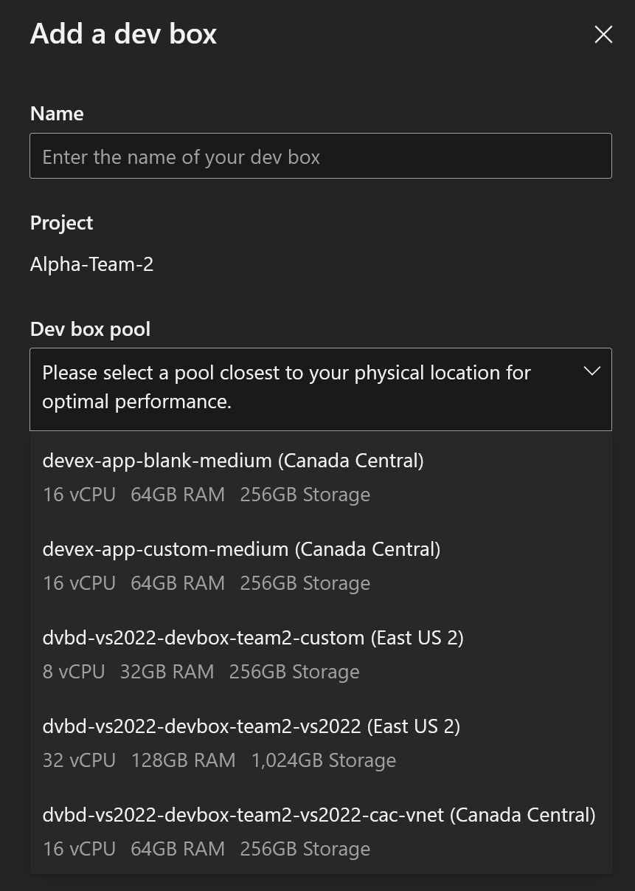
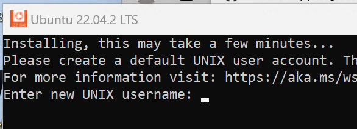
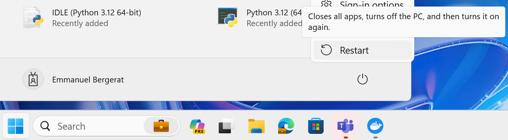
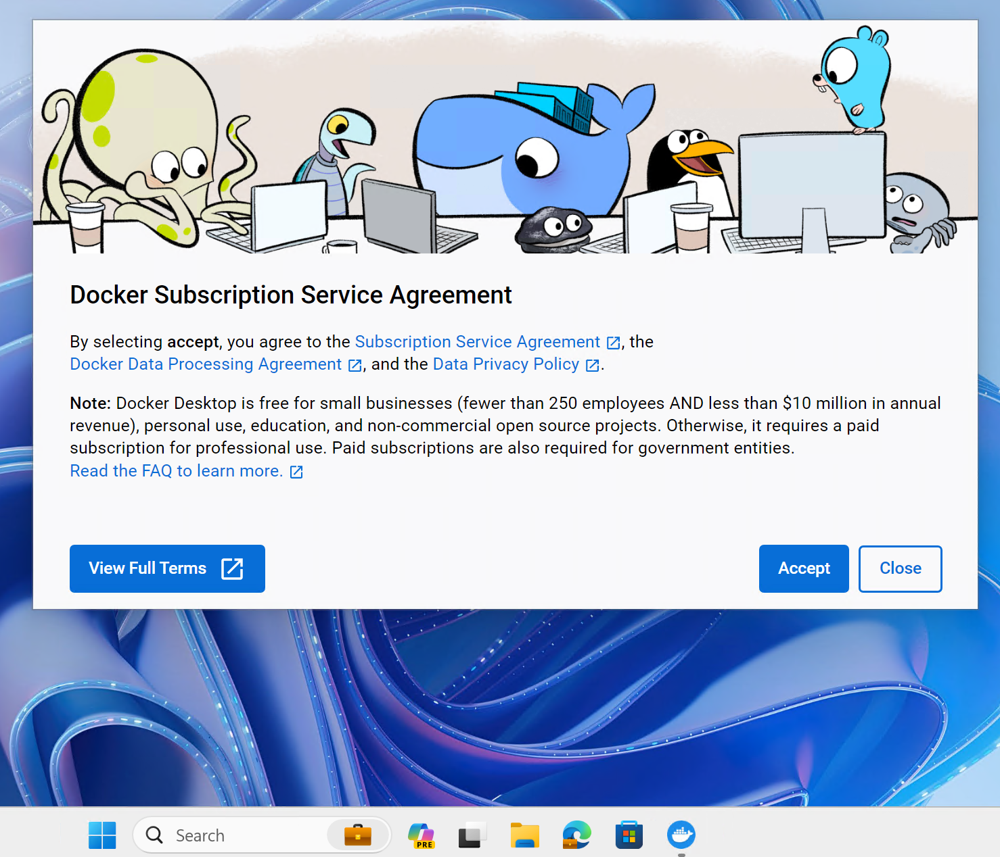
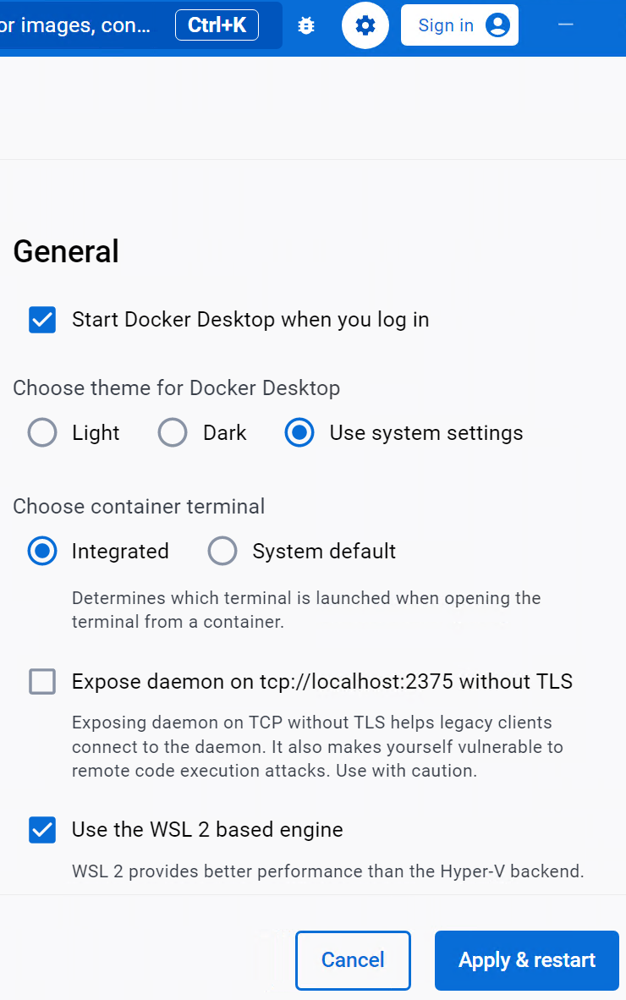
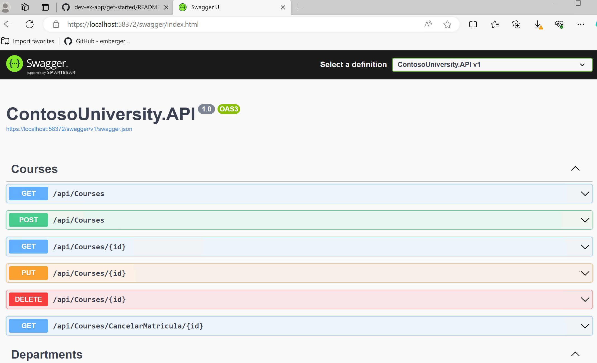
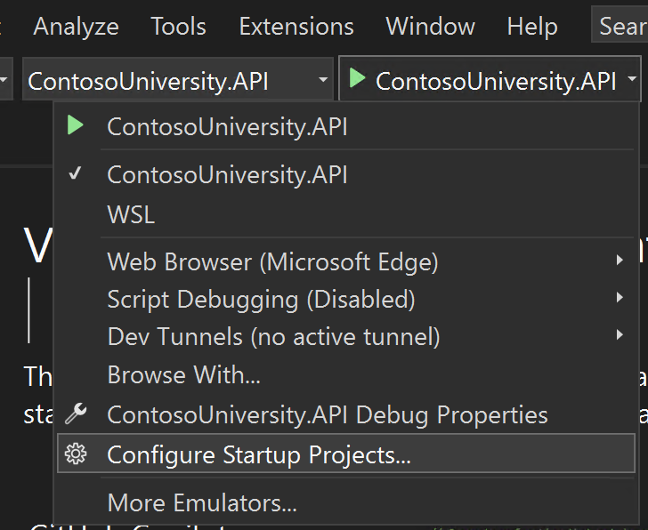
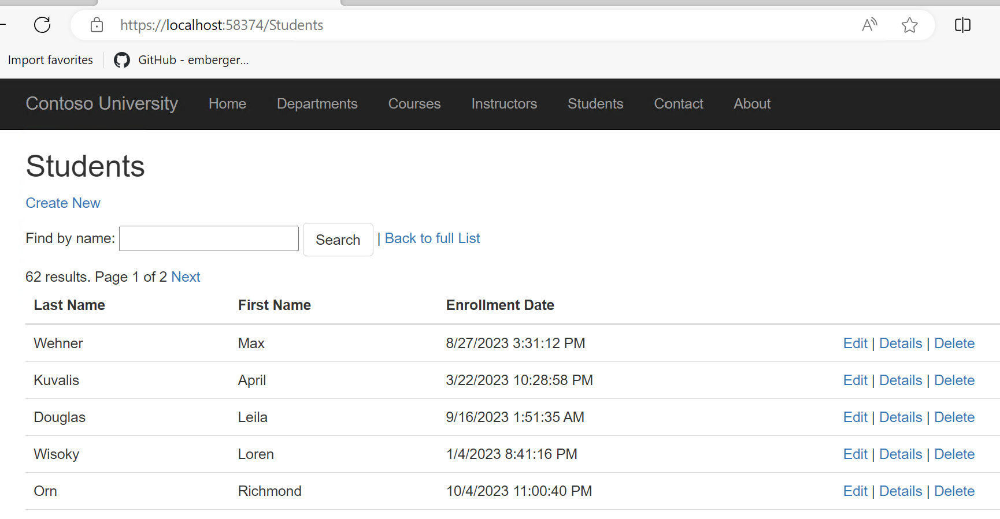

# New developer setup

## Overview

As a new developer in the Contoso University app team, you are given access to a DevBox environment pre-configured to speed up your on-boarding.

The process to get started is:

1. [Access the DevBox environment,](#1-devbox-access)
2. [Log in with your account,](#2-log-in-with-your-work-account)
3. [Create a DevBox machine (can take up to 45 minutes),](#3-create-a-devbox)
4. Install development tooling:
    1. [Install tooling,](#1-install-packages)
    2. [Finish Docker desktop setup](#2-finish-docker-desktop-install)
5. [Get and configure the Contoso University app on your DevBox,](#5-get-and-configure-the-app)
6. [Develop, debug, etc.,](#6-develop-test-create-a-pr)
7. [Turn the DevBox off.](#7-shutdown-the-dev-box)

## Steps

### 1. DevBox access

The DevBox machine is running in Azure. It can be accessed with:

- either [the DevBox web portal](https://devportal.microsoft.com/),
- or the remote desktop client:
  - [For Windows](https://learn.microsoft.com/en-us/azure/dev-box/tutorial-connect-to-dev-box-with-remote-desktop-app?tabs=windows#tabpanel_1_windows),
  - [For Non-Windows](https://learn.microsoft.com/en-us/azure/dev-box/tutorial-connect-to-dev-box-with-remote-desktop-app?tabs=windows#tabpanel_1_non-Windows).

### 2. Log in with your work account

In both cases, you need to authenticate with your work microsoft account.

### 3. Create a DevBox

Go to the [DevBox web portal](https://devportal.microsoft.com/) and log in.

Once logged-in, you can either:

  - `Start`, `Stop`, `Delete`, `Log in` an existing dev box(es),

or:

  - `Create` a new Dev box:

      1. Click the `+ New dev box` button

      

      2. Add a new dev box entering a `Name` and selecting a `Dev box pool`

      

      3. Click `Create`

      4. Go grab lunch, coffee, etc.

      5. See [Dev box access](#1-devbox-access) to log in to the new box, once created and `Running`.

### 4. Install tooling

#### 1. Install packages

1. Download the script: [1-install-tooling.ps1](https://github.com/embergershared/dev-ex-app/blob/main/1.get-started/1-install-tooling.ps1) (Suggestion: Open in a new tab)

2. Choose `Keep` when asked


3. Launch a terminal **AS Administrator**


4. Execute these commands:

      ```powershell
      # Launch the downloaded script:
      Set-Location $HOME\Downloads
      Set-ExecutionPolicy Bypass -Force
      .\1-install-tooling.ps1

      ```

      > Note: During the installation, the Ubuntu WSL setup window will appear:
      > 

5. Restart the Dev box

      Docker desktop gets installed, but it requires a restart to perform UI last steps:

      - **Restart** the Dev box:

      

#### 2. Finish Docker desktop install

  > Note: you need to restart for `Docker Desktop` to launch.

- Launch the shortcut on the Desktop (if not showing up by itself):

  

- `Accept` the Service Agreement:

  

- `Sign up`, `Sign in` or `Continue without signing in` - up to you,

- `Fill` or `Skip` about your role - up to you,

- go to settings (gear in top right) and check enable `General` / `Start Docker Desktop when you log in`,

- `Apply & restart`,

  

- Check `Engine running` status.

### 5. Get and configure the app

1. Download the script: [2-app-local-setup](https://github.com/embergershared/dev-ex-app/blob/main/1.get-started/2-app-local-setup.ps1) (Suggestion: Open in a new tab)


2. Launch a terminal

3. Execute these commands:

      ```powershell
      # Launch the downloaded script:
      Set-Location $HOME\Downloads
      .\2-app-local-setup.ps1

      ```

      The script:

      - Clones the app repo locally,
      - Logs you in Azure,
      - Generate basics `git` settings for your commits,
      - Ask for a SQL Server `sa` account password (requirements are tested):

        

      - Create a Microsoft SQL Server 2022 container for your dev database,
      - Wire the settings in the application for it to use the local container SQL Server,
      - Launch Visual Studio and open the `Contoso University` App solution.

4. Sign in to Visual Studio

      - Log in to your different accounts (Microsoft, Azure, Github)

      > Note: `File` > `Account settings` is useful to manage them.

5. Success looks like:


### 6. Develop, test, create a PR

Development work, with Github Copilot help.

Here are some getting started suggested steps:

1. Populate the database with data:

      - Set startup project to the API:

      

      - Start the API:

      

      - Browse to the Swagger UI: [https://localhost:58372/swagger](https://localhost:58372/swagger)

      

2. Configure APP and API to start together:

      - Go to configure Startup Projects:

      

      - Set Startup for both APP and API:

      

      - Click `Start`:

      

      - Success looks like:

          - Home page:

            

          - Students list:

            

          - Student details with embedded courses' list:

            

### 7. Shutdown the Dev box

1. Go to the [DevBox web portal](https://devportal.microsoft.com/)

2. On the dev box tile:

   - Click on the "3 dots"

   - Select `Shut down`

   
