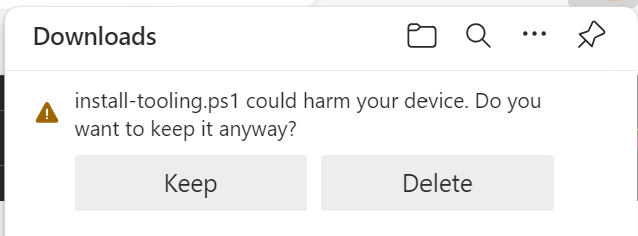
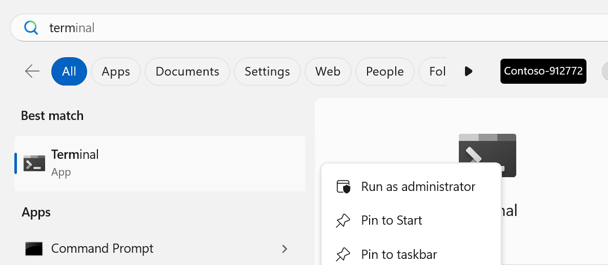
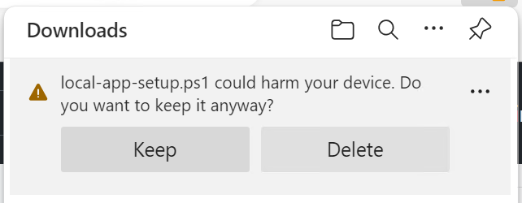
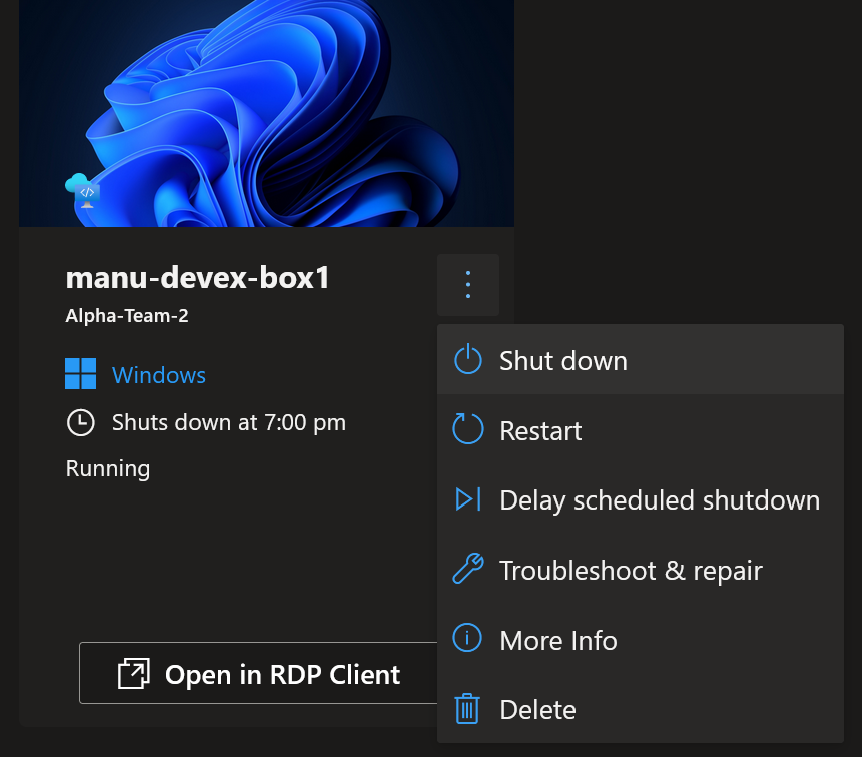

# New developer setup

## Overview

As a new developer in the Contoso University app team, you are given access to a DevBox environment pre-configured to speed up your on-boarding.

The process to get started is:

1. Access the DevBox environment
2. Log in with your account
3. Create a DevBox machine (can take up to 45 minutes)
4. Install development tooling
5. Get and configure the Contoso University app on your DevBox
6. Develop, debug, etc.,
7. Turn the DevBox off.

## Steps

### 1. DevBox access

The DevBox machine is running in Azure. It can be accessed with:

- either [the DevBox web portal](https://devportal.microsoft.com/),
- or the remote desktop client:
  - [For Windows](https://learn.microsoft.com/en-us/azure/dev-box/tutorial-connect-to-dev-box-with-remote-desktop-app?tabs=windows#tabpanel_1_windows),
  - [For Non-Windows](https://learn.microsoft.com/en-us/azure/dev-box/tutorial-connect-to-dev-box-with-remote-desktop-app?tabs=windows#tabpanel_1_non-Windows).

### 2. Log in with your work account

In both cases, you need to authenticate with your work microsoft account.

### 3. Create a DevBox

Once logged-in, you can create a new DevBox by:

1. Do this
2. then that

> Note: The portal will also show your existing DevBox(es). In that, case, skip the rest of these instructions (they should be done already).

### 4. Install tooling

1. Download the script: [install-tooling.ps1](https://github.com/embergershared/dev-ex-app/blob/main/get-started/install-tooling.ps1) (Suggestion: Open in a new tab)

2. Choose `Keep` when asked



3. Launch a terminal **AS Administrator**



4. Execute these commands:

```powershell
# Launch the downloaded script:
Set-Location $HOME\Downloads
Set-ExecutionPolicy Bypass -Force
.\install-tooling.ps1
```

5. Finish Docker desktop install

Docker desktop gets installed, but requires UI last steps:

- Launch the shortcut on the Desktop,
- `Accept` the Service Agreement,
- `Sign up`, `Sign in` or `Continue without signing in` - up to you,
- `Skip` about your role - up to you,
- go to settings to enable `Start Docker Desktop when you log in`,
- `Apply & restart`,
- Check `Engine running` status.

### 5. Get and configure the app

1. Download the script: [local-app-setup](https://github.com/embergershared/dev-ex-app/blob/main/get-started/local-app-setup.ps1) (Suggestion: Open in a new tab)



2. Launch a terminal

3. Execute these commands:

```powershell
# Launch the downloaded script:
Set-Location $HOME\Downloads
Set-ExecutionPolicy Bypass -Force
.\local-app-setup.ps1
```

The script:

- Clones the app repo locally,
- Logs you in Azure,
- Generate basics `git` settings for your commits,
- Ask you to set a local container SQL Server administrator account,
- Create a Microsoft SQL Server 2022 container for your dev database,
- Wire the settings in the application for it to use the local container SQL Server,
- Launch Visual Studio on the Contoso University App solution.

### 6. Develop, test, create a PR

Development work, with Github Copilot help.

### 7. Shutdown the Dev box

1. Go to the [DevBox web portal](https://devportal.microsoft.com/)

2. On the dev box tile:

   - Click on the "3 dots"

   - Select "Shutdown"

   
